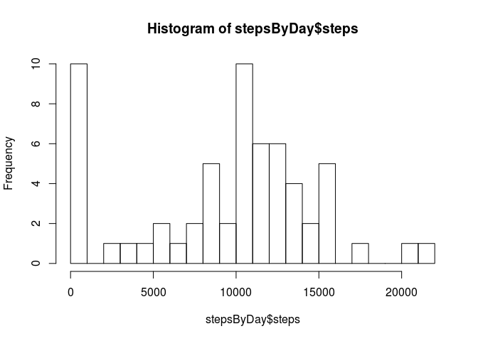
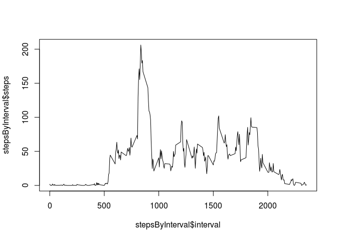
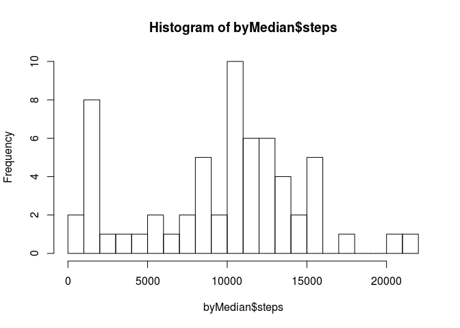
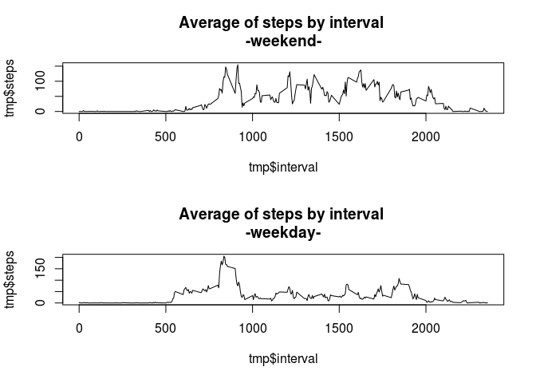

# Reproducible Research: Peer Assessment 1
mherradora  
March 15, 2015  

## Loading and preprocessing the data
In the first step, we have to load the data:


```r
activity <- read.csv("activity.csv", stringsAsFactors=FALSE)
activity <- activity[,c(2,3,1)]
activity <- activity[order(activity$date,activity$interval),]
activity$date <- as.Date(activity$date,"%Y-%m-%d")
```

## What is mean total number of steps taken per day?
We have to calculate the total number of steps taken per day:


```r
attach(activity)
stepsByDay <- aggregate(steps,by=list(date),sum,na.rm=T)
detach(activity)
names(stepsByDay) <- c("date","steps")
```

With this information, we plot an histogram of the total number of steps taken each day.


```r
hist(stepsByDay$steps,breaks=20)
```

 

```r
steps_mean <- mean(stepsByDay$steps,na.rm=T)
steps_median <- median(stepsByDay$steps,na.rm=T)
```

Now, we know that the mean of steps is 9354.2295082 and the median of steps is 10395.

## What is the average daily activity pattern?

In search of a better understanding of the data, we plot the average of steps by interval:

```r
attach(activity)
stepsByInterval <- aggregate(steps,by=list(interval),mean,na.rm=T)
detach(activity)
names(stepsByInterval) <- c("interval","steps")
plot(stepsByInterval$interval,stepsByInterval$steps,type = "l")
```

 


```r
max_steps <- max(stepsByInterval$steps)
max_interval <- stepsByInterval[stepsByInterval$steps==max_steps,]$interval
```

This graph shows that the interval 835 have the maximun average of steps: 206.1698113.

## Imputing missing values


```r
na_total <- sum(is.na(activity$steps))
```

The data has a problem of missing values. The total of missing are 2304. Looking for a solution to this problem, we will fill this values using the median of the values of the same date or the same interval in a new dataset.


```r
newActivity <- activity
newActivity$stepsNewMedian <- newActivity$steps

for(i in 1:dim(newActivity)[1]){
  if(is.na(newActivity[i,]$steps)){
    current_date <-newActivity[i,]$date
    current_interval <-newActivity[i,]$interval
    similars <- newActivity[newActivity$date==current_date | newActivity$interval==current_interval,]
    newValueMedian <- median(similars$steps,na.rm = T)
    newActivity[i,]$stepsNewMedian <- newValueMedian
  }
}
newActivity$steps <- newActivity$stepsNewMedian
newActivity$stepsNewMedian <- NULL
```

Now we can recalculate the value of the mean and median of steps and plot a new histogram.


```r
attach(newActivity)
byMedian <- aggregate(steps,by=list(date),sum,na.rm=T)
detach(newActivity)
names(byMedian) <- c("date","steps")

hist(byMedian$steps,breaks=20)
```

 

```r
steps_mean2 <- mean(byMedian$steps,na.rm=T)
steps_median2 <- median(byMedian$steps,na.rm=T)

dif_mean <- 100*((steps_mean2 / steps_mean)-1)
dif_median <- 100*((steps_median2 / steps_median)-1)
```

We this information, we know that the mean of steps is 9503.8688525 and the median is 10395. This values differ from the originals in 1.5996972% for the mean and 0% for the median.

## Are there differences in activity patterns between weekdays and weekends?

An hypothesis to consider is about the impact of the different kind of days. We have to consider if a person is walking on a weekday or walking on a weekend. To analyse this hypothesis we create a new variable with the date. At the end, we plot a graph for weekdays and other for weekend days.


```r
newActivity$weekDay <- weekdays((newActivity$date),T)
newActivity$typeDay <- ifelse(newActivity$weekDay=="Sat" | newActivity$weekDay=="Sun","weekend","weekday")

attach(newActivity)
ByInterval <- aggregate(steps,by=list(interval,typeDay),mean,na.rm=T)
detach(newActivity)
names(ByInterval) <- c("interval","typeDay","steps")

par( mfrow=c(2,1) )
tmp <- ByInterval[ByInterval$typeDay=="weekend",]
plot(tmp$interval,tmp$steps,type = "l",main="Average of steps by interval \n-weekend-")
tmp <- ByInterval[ByInterval$typeDay=="weekday",]
plot(tmp$interval,tmp$steps,type = "l",main="Average of steps by interval \n-weekday-")
```

 

```r
par(mfrow=c(1,1) )
```

The hypothesis seems to be real for some intervals. 
